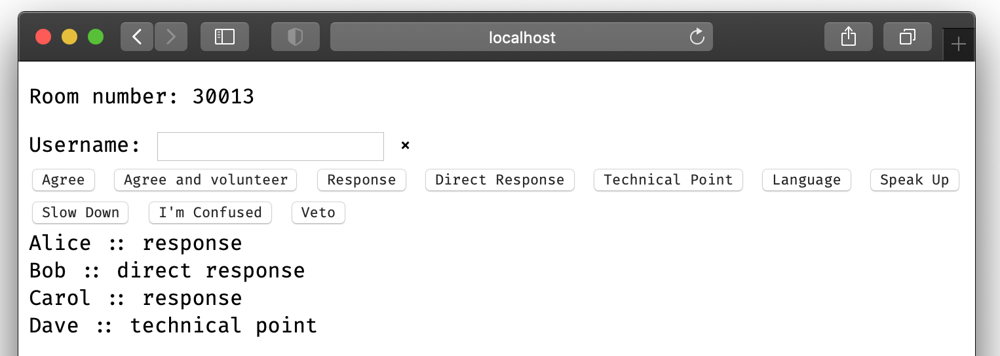

# Meeting Mood

Consensus hand signals for online meetings

## Installation:

This application needs to be run somewhere with a public IP so that people can connect to it.

The easiest way of doing this is to deploy this repository as a Dokku app.  We presume that you can also push it as a Heroku app, but that is untested.

There are a number of other ways you can get hold the binary to run:

* Download the appropriate binary from the [latest release](https://github.com/WheresAlice/meeting-mood/releases/latest)
* Run `brew install wheresalice/meeting-mood/meeting-mood` to install via Homebrew
* Clone this repo and run `go build`

If you are running the binary outside of Dokku/Heroku then it will listen on port 8844 by default.

## Configuration Options

You can optionally:

* Specify the environment variable `PORT=8080` or pass the flag `--port 8080` to override the port number
* Put a footer.html in your current directory, and the contents will be displayed as a footer.

## Usage

1. Open a web browser to the web server and you'll see a button to create a room.  This will create a room and put you in it.
2. Share the address in the address bar with other members of the meeting.
3. Set your username (this will be saved in a cookie)
4. Press buttons to make hand signals
5. Press `x` to stop making a hand signal

## Known Issues

- HTTPS through Ngrok doesn't work
- There is no authentication or authorisation
- Hardcoded set of moods (for consensus decision making)
- No sorting of moods
- Not very mobile friendly
- Probably not very performant in places

## Donations

## License

meeting-mood is released under the [MIT license](LICENSE).